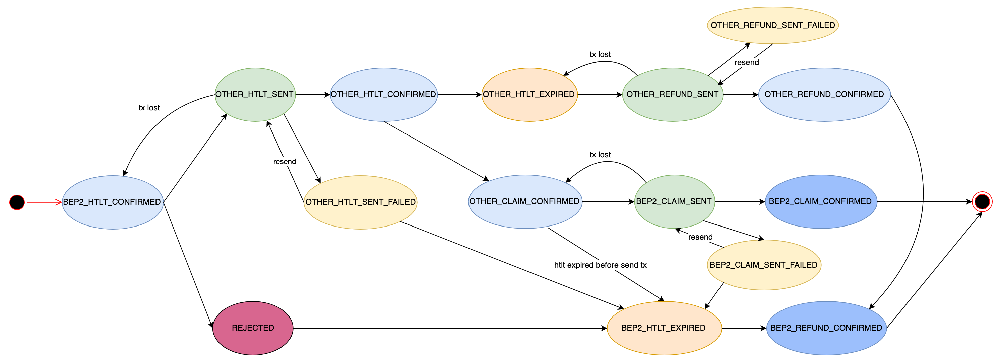
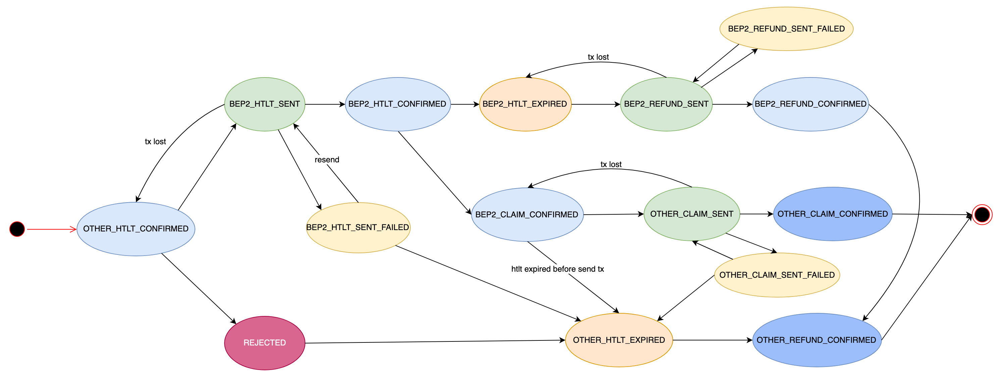

## Overview

This doc describes lifecycle of two types of swap request:
+ swap from binance chain to other chain
+ swap from other chain to binance chain

There would be many intermediate statuses during the lifecycle of a swap request. Deputy is responsible for managing these 
statuses and send corresponding txs timely. For example, a swap request from other chain to binance chain will start at
when HTLT tx confirmed by blockchain, and the lifecycle will end at when deputy claimed tokens if everything goes well or 
the lifecycle will end at when user refund tokens if there is something wrong.

The below parts describe all statuses a swap request may go through.

## Swap from binance chain to other chain

## Swap from other chain to binance chain

## Swap Status

+ OTHER_HTLT_CONFIRMED: HTTL tx on other chain is confirmed by a number of blocks which is specified in config.
+ OTHER_HTLT_SENT: HTLT tx is sent on other chain by deputy but it is not confirmed by blockchain.
+ OTHER_HTLT_EXPIRED: HTLT tx on other chain is expired. tx could be sent by user and deputy.
+ OTHER_HTLT_SENT_FAILED: HTLT tx sent on other chain by deputy is failed. it can be failed like balance is not enough.
+ OTHER_CLAIM_SENT: claim tx is sent on other chain by deputy but it is not confirmed by blockchain.
+ OTHER_CLAIM_SENT_FAILED: claim tx sent on other chain by deputy is failed. it can be failed like balance is not enough.
+ OTHER_CLAIM_CONFIRMED: claim tx on other chain is confirmed by a number of blocks which is specified in config.
+ OTHER_REFUND_SENT: refund tx is sent on other chain by deputy but it is not confirmed by blockchain.
+ OTHER_REFUND_SENT_FAILED: refund tx sent on other chain by deputy is failed. it can be failed like balance is not enough.
+ OTHER_REFUND_CONFIRMED: refund tx on other chain is confirmed by a number of blocks which is specified in config.

+ BEP2_HTLT_CONFIRMED: HTTL tx on binance chain is confirmed by a number of blocks which is specified in config.
+ BEP2_HTLT_SENT: HTLT tx is sent on binance chain by deputy but it is not confirmed by blockchain.
+ BEP2_HTLT_EXPIRED: HTLT tx on binance chain is expired. tx could be sent by user and deputy.
+ BEP2_HTLT_SENT_FAILED: HTLT tx sent on binance chain by deputy is failed. it can be failed like balance is not enough.
+ BEP2_CLAIM_SENT: claim tx is sent on binance chain by deputy but it is not confirmed by blockchain.
+ BEP2_CLAIM_SENT_FAILED: claim tx sent on binance chain by deputy is failed. the failed reason may be different.
+ BEP2_CLAIM_CONFIRMED: claim tx on binance chain is confirmed by a number of blocks which is specified in config.
+ BEP2_REFUND_SENT: refund tx is sent on other chain by deputy but it is not confirmed by blockchain.
+ BEP2_REFUND_SENT_FAILED: refund tx sent on binance chain by deputy is failed. he failed reason may be different
+ BEP2_REFUND_CONFIRMED: refund tx on binance chain is confirmed by a number of blocks which is specified in config.

+ REJECTED: swap request was rejected by deputy. for example, if the swap amount exceeds the max swap amount deputy accepts, it will be rejected.

### Statuses changed when tx confirmed

Swap status will turn to one of these statuses(blue ones in upper pictures) when corresponding tx is confirmed: 
+ OTHER_HTLT_CONFIRMED
+ OTHER_CLAIM_CONFIRMED
+ OTHER_REFUND_CONFIRMED
+ BEP2_HTLT_CONFIRMED
+ BEP2_CLAIM_CONFIRMED
+ BEP2_REFUND_CONFIRMED

But in some cases, like tx sent is lost in blockchains which means tx is not confirmed after a while, swap status 
will changed to one of those statuses. Deputy will try to send corresponding tx again.

### Statuses changed when tx sent

Swap status will turn to one of these statuses(green ones in upper pictures) when corresponding tx is sent:
+ OTHER_HTLT_SENT
+ OTHER_CLAIM_SENT
+ OTHER_REFUND_SENT
+ BEP2_HTLT_SENT
+ BEP2_CLAIM_SENT
+ BEP2_REFUND_SENT

### Statuses changed when HTTL tx is expired

Swap status will turn to one of these statuses(yellow ones in upper pictures) when HTLT tx is expired:
+ OTHER_HTLT_EXPIRED 
+ BEP2_HTLT_EXPIRED

### Statuses changed when tx sent failed

Swap status will turn to one of these statuses(orange ones in upper pictures) when tx sent is failed:
+ OTHER_HTLT_SENT_FAILED
+ OTHER_CLAIM_SENT_FAILED
+ OTHER_REFUND_SENT_FAILED
+ BEP2_HTLT_SENT_FAILED
+ BEP2_CLAIM_SENT_FAILED
+ BEP2_REFUND_SENT_FAILED

When tx sent is failed, deputy will not resend tx automatically because the failed reason may vary with cases.
You need to resend corresponding tx manually if issue causing failed tx is fixed.

For example, HTLT tx sent in ethereum may failed if the allowance of erc20 token is not enough, so if you approve 
enough tokens to swap contract, then you can resend HTLT tx which should succeed.

### Special statuses

There are some special cases:
+ REJECTED

Deputy will reject swap if swap amount or expire height span is not right. It will also reject swap 
if HTLT tx created by user will expire soon.

### End statuses

There are two end statuses for each swap type.

For swap type from other chain to binance chain, the two end statuses are:
+ BEP2_CLAIM_CONFIRMED
+ BEP2_REFUND_CONFIRMED

For swap type from binance chain to other chain, the two end statuses are:
+ OTHER_CLAIM_CONFIRMED
+ OTHER_REFUND_CONFIRMED
